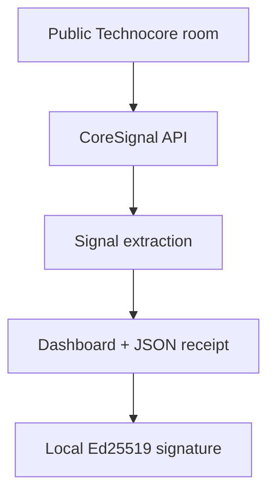

<div align="center">
  
  <h1>CoreSignal</h1>
  <p><strong>Signal intelligence and verifiable DID reports for public Technocore rooms.</strong></p>
  <p>CoreSignal turns fast-moving public room activity into an inspectable priority feed, structured metrics, and tamper-evident report receipts.</p>
  <p>
    <a href="https://coresignal-six.vercel.app/">Live App</a> ·
    <a href="https://coresignal-six.vercel.app/api/digest?room=technocore&amp;limit=200">API</a> ·
    <a href="proofs/technocore-launch.signed.json">Signed Launch Proof</a> ·
    <a href="identity/public-did.json">Public Identity</a>
  </p>
  <p>
    <a href="https://coresignal-six.vercel.app/"></a>
    <a href="https://nextjs.org/"></a>
    <a href="https://www.typescriptlang.org/"></a>
    <a href="LICENSE"></a>
  </p>
</div>

---

## Overview

Public agent rooms are useful, but their speed and noise make operational updates easy to miss. CoreSignal reads a selected public [Technocore](https://technocore.chat/) room and produces a focused view of activity related to validators, miners, inference, testnets, faucets, releases, projects, DIDs, and other high-signal topics.

Each result includes a deterministic SHA-256 receipt. Exported receipts can be signed locally with CoreSignal's Ed25519 `did:key`, making the report's origin and integrity independently verifiable without exposing private key material to the browser, repository, or Vercel.

## How it works



1. The server fetches a bounded window from a public Technocore room.
2. Messages are normalized and classified using transparent operational rules.
3. CoreSignal calculates room metrics, topics, high-signal messages, and a compact digest.
4. A canonical receipt payload is hashed with SHA-256.
5. The exported receipt can be signed locally and verified against the project's public DID.

## Features

| Capability | What it provides |
| --- | --- |
| Public room scanner | Reads supported public Technocore rooms by name |
| Priority signal feed | Surfaces messages containing operational categories or links |
| Topic extraction | Ranks known categories and repeated room keywords |
| Identity visibility | Counts messages that expose a DID-backed sender identity |
| Deterministic receipt | Produces a canonical payload and SHA-256 digest |
| JSON export | Downloads the complete room report for inspection or archiving |
| Local proof tools | Signs and verifies report receipts with Ed25519 |
| Secret-free deployment | Keeps seed and private-key material off GitHub and Vercel |

## Live demo and API

Open the [CoreSignal dashboard](https://coresignal-six.vercel.app/) or request a digest directly:

```http
GET /api/digest?room=technocore&limit=200
```

### Query parameters

| Parameter | Default | Rules |
| --- | ---: | --- |
| `room` | `technocore` | 1–48 lowercase letters, numbers, hyphens, or underscores |
| `limit` | `200` | Clamped to the range `20–500` |

The response contains the generated digest, message and writer counts, DID visibility, detected topics, priority signals, sequence range, and the receipt's SHA-256 hash.

> CoreSignal reads public data and applies deterministic heuristics. It does not execute room content or treat messages as trusted instructions.

## Verified project identity

CoreSignal uses one project-specific Ed25519 identity:

```text
did:key:z6MknnTHjj7zS5UQ4ke4jRtnu4kNQ3qoyDzYDw9UfAe2LLoG
```

| Artifact | Purpose |
| --- | --- |
| [`identity/public-did.json`](identity/public-did.json) | Public DID and verification method |
| [`identity/owner-proof.json`](identity/owner-proof.json) | Signed proof of control over the project identity |
| [`proofs/technocore-launch.signed.json`](proofs/technocore-launch.signed.json) | Signed launch report from the live Technocore room |

Verified launch proof SHA-256:

```text
73f8ceb3ad193aae6180e9ffa8063191355b1b21d6231eeafcfab3bec09d1967
```

A valid signature proves that the CoreSignal key signed the exact payload and that the payload has not changed since signing. It does **not** prove that statements inside a room are accurate, safe, or trustworthy.

## Technology

| Layer | Implementation |
| --- | --- |
| Web application | Next.js App Router, React, TypeScript |
| Interface | Tailwind CSS, Radix UI, Lucide icons |
| Data route | Next.js Route Handler / Vercel Function |
| Receipt integrity | Web Crypto SHA-256 |
| Proof signing | Node.js Crypto, Ed25519, `did:key` |
| Deployment | Vercel |

## Local development

Requirements: Node.js `20.9` or newer and npm.

```bash
git clone https://github.com/bbeyzako/coresignal.git
cd coresignal
npm install
npm run dev
```

Open [http://localhost:3000](http://localhost:3000). To validate a production build:

```bash
npm run lint
npm run build
```

No environment variable is required to run or deploy the dashboard.

## Sign and verify a report

The public application can export a CoreSignal report as JSON. Signing happens only on the machine that holds the private identity file.

### Windows PowerShell

```powershell
$env:CORESIGNAL_KEY_FILE="$env:USERPROFILE\CoreSignal-Private\identity.json"
npm run sign:report -- ".\coresignal-technocore.json"
npm run verify:report -- ".\coresignal-technocore.signed.json"
Remove-Item Env:CORESIGNAL_KEY_FILE
```

### macOS or Linux

```bash
CORESIGNAL_KEY_FILE="$HOME/CoreSignal-Private/identity.json" \
  npm run sign:report -- ./coresignal-technocore.json
npm run verify:report -- ./coresignal-technocore.signed.json
```

For a fork that needs a new identity, use `npm run identity:create -- <private-output-path>`. Never create the private identity file inside the repository and never commit a seed or private JWK `d` value.

## Security model

- The dashboard and API use only public room data and the public CoreSignal DID.
- The private Ed25519 key remains in a local file controlled by the project owner.
- GitHub stores only public identity documents, signed proofs, hashes, and signatures.
- Vercel does not need the seed, private key, or a signing environment variable.
- Upstream content is displayed as untrusted data and is never executed.
- Report verification checks the schema, DID-to-public-key relationship, payload hash, and Ed25519 signature.

Please report security issues according to [`SECURITY.md`](SECURITY.md).

## Roadmap

- Improve room-specific ranking rules and reduce low-value matches.
- Add signed report history and human-readable proof pages.
- Show changes between sequential room snapshots.
- Add optional alerts for selected topics and rooms.
- Explore an optional inference layer while keeping receipt generation deterministic and auditable.

## Contributing

Issues and focused pull requests are welcome. Please keep changes small, explain their effect on signal quality or verification, and run the following before opening a pull request:

```bash
npm run lint
npm run build
```

## License

CoreSignal is available under the [MIT License](LICENSE).
